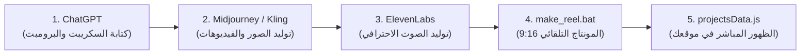

# 🎬 دليل استوديو الذكاء الاصطناعي وصناعة المشاريع والريلز
### خاص بالمهندس عبد السلام — AM Marketing

مرحباً يا هندسة! هذا الدليل يضع بين يديك منظومة متكاملة لإنتاج **ريلز احترافية، وتصاميم 3D سينمائية، ومونتاج سريع بالذكاء الاصطناعي**، وإضافتها إلى البرتفوليو الخاص بك في دقائق معدودة.

---

## 📂 أين تجد ملفات وأكواد الاستوديو؟
جميع الأدوات موجودة الآن في جهازك داخل المسار:
```
D:\portfolio\ai-studio-tools\
```
وتحتوي على:
1. `make_reel.bat`: أداة التشغيل بنقرة واحدة (1-Click) أو بالسحب والإفلات (Drag & Drop) لأي فيديو أو صورة.
2. `ai_reel_maker.py`: محرك المونتاج الذكي المعتمد على FFmpeg (تحويل أبعاد، إضافة بلور سينمائي، تحريك الصور Ken Burns، دمج الصوت والنصوص).
3. `gpt_prompts_master.json`: مكتبة البرومبتات والأكواد الجاهزة للنسخ لشات جي بي تي.
4. `GUIDE_AR.md`: هذا الدليل الشامل.

---

## 🚀 رحلة العمل الكاملة خطوة بخطوة (من الفكرة إلى البرتفوليو)



---

### الخطوة 1: شات جي بي تي (ChatGPT) — صياغة السكريبت والبرومبتات
افتح شات جي بي تي وانسخ هذا البرومبت المبتكر:

> **برومبت سكريبت الريلز (انسخه في ChatGPT):**
> ```text
> أنت خبير تسويق بالمحتوى ومونتاج ريلز فيروسية لبراند AM Marketing (بإدارة عبد السلام).
> أريدك أن تكتب سكريبت ريلز احترافي مدته 25 ثانية عن: [اكتب موضوعك هنا، مثلاً: أحدث أنظمة إطفاء الحريق والسلامة في السعودية].
>
> السكريبت يجب أن يحتوي بدقة على:
> 1. الثانية (0 إلى 3): الهوك (Hook) صادم ومباشر بدون مقدمات.
> 2. المشاهد البصرية (B-Roll): وصف دقيق للمشاهد باللغة الإنجليزية لأقوم بتوليدها في Midjourney/Runway.
> 3. التعليق الصوتي (Voiceover): النص باللهجة (السعودية / المصرية) مع علامات الوقف.
> 4. النصوص على الشاشة (Captions): كلمات مفتاحية مؤثرة تظهر على الفيديو.
> 5. الـ CTA: دعوة للتواصل مع عبد السلام AM Marketing.
> ```

---

### الخطوة 2: توليد الصور والفيديوهات (AI Visuals)
استخدم الأوصاف الإنجليزية الناتجة من شات جي بي تي في أحد المواقع التالية:
* **لتوليد الصور 3D و 8K الواقعية:**
  * [Midjourney v6](https://midjourney.com) أو [Flux AI](https://blackforestlabs.ai) أو [Leonardo.ai](https://leonardo.ai).
  * مثال برومبت جاهز لأنظمة السلامة ومكافحة الحريق:
    `Ultra-realistic 8k cinematic shot of a futuristic fire safety valve room, high pressure red pipes, digital glowing pressure meters, volumetric lighting, photorealistic --ar 9:16 --v 6.0`
* **لتحريك الصور أو توليد فيديو سينمائي:**
  * [Runway Gen-3](https://runwayml.com) أو [Kling AI](https://klingai.com) أو [Luma Dream Machine](https://lumalabs.ai).
  * استخدم حركة الكاميرا: `FPV drone push-in, volumetric cinematic lighting, 60fps`.

---

### الخطوة 3: توليد الفويس أوفر (Voiceover)
* ادخل على [ElevenLabs](https://elevenlabs.io).
* اختر لغة عربية (Multilingual v2).
* الصق نص التعليق الصوتي واضبط النبرة:
  * Stability: 45%
  * Clarity: 85%
* حمّل الملف الصوتي (مثلاً `voice.mp3`).

---

### الخطوة 4: المونتاج السريع بضغطة زر واحدة (Automation)
لديك طريقتان أسهل من بعض:

#### الطريقة (أ) — السحب والإفلات (Drag & Drop):
1. اسحب ملف الفيديو أو الصورة من جهازك بيدك بالماوس وأسقطه فوق الملف:
   `D:\portfolio\ai-studio-tools\make_reel.bat`
2. ستفتح شاشة سوداء وتطلب منك اختيار:
   * اضغط `1`: لتحويل أي فيديو أفقي إلى ريلز عمودي 9:16 احترافي بدون حواف سوداء (مع خلفية بلور سنمائية ناعمة).
   * اضغط `2`: لتحويل أي صورة عادية إلى فيديو متحرك سينمائي بنظام Ken Burns Zoom مدته 6 ثواني بجودة 1080x1920.
3. الفيديو النهائي ستجده فوراً محفوظاً في:
   `D:\portfolio\public\assets\videos\`

#### الطريقة (ب) — التشغيل التفاعلي (Interactive Mode):
فقط اضغط دبل كليك على `make_reel.bat`، وسيفتح لك قائمة لاختيار الملف وإضافة النصوص المائية والشعار!

---

### الخطوة 5: إضافة المشروع المكتمل إلى البرتفوليو
كل ما عليك هو فتح الملف:
`D:\portfolio\src\data\projectsData.js`

وقم بإضافة كود المشروع الجديد في أول مصفوفة `projectsData`:

```javascript
  {
    id: "ai-safety-reel",
    title: {
      ar: "ريلز أنظمة السلامة الذكية 4K",
      en: "Smart Safety Systems 4K AI Reel"
    },
    category: "ai",
    categories: ["ai", "ads"],
    featured: true,
    image: "/assets/images/almajal_hero.webp",
    video: "/assets/videos/اسم_الفيديو_الجديد.mp4",
    description: {
      ar: "إنتاج ومونتاج إعلان ريلز بالذكاء الاصطناعي يوضح حلول مكافحة الحريق مع تعليق صوتي سينمائي.",
      en: "AI-generated commercial reel showcasing fire safety solutions with cinematic sound design."
    },
    challenge: {
      ar: "تحويل البيانات الهندسية الجافة إلى محتوى تسويقي مرئي خاطف للأنظار.",
      en: "Translating technical engineering specs into an eye-catching viral short."
    },
    solution: {
      ar: "توليد المشاهد عبر Midjourney وتحريكها سينمائياً ومونتاجها بمحرك AI Studio بنسبة 9:16.",
      en: "Synthesized via Midjourney v6 and animated with custom 9:16 reel pipeline."
    },
    metrics: [
      { label: { ar: "المشاهدات", en: "Views" }, value: "+180K" },
      { label: { ar: "معدل الإكمال", en: "Completion" }, value: "78%" },
      { label: { ar: "التحويلات", en: "Leads" }, value: "+320" }
    ],
    tags: ["AI Studio", "Reels", "AM Marketing", "Runway Gen-3"],
    link: "https://almajal-safety.com/"
  },
```

احفظ الملف وسيقوم موقع البرتفوليو بتحديث نفسه فوراً بدون حتى الحاجة لإعادة التشغيل!

---
🎯 **مبروك! أصبح لديك استوديو إنتاج متكامل في جهازك.**
إذا احتجت توليد أي فيديو تجريبي الآن، أخبرني فوراً وسأقوم بتنفيذه معك خطوة بخطوة.
